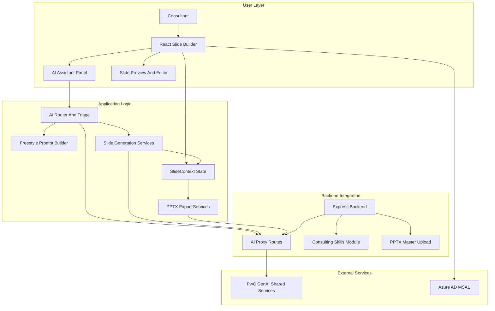
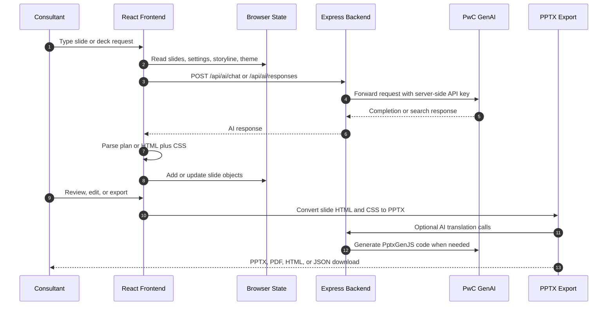
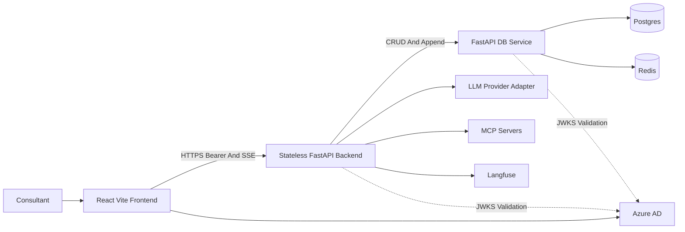
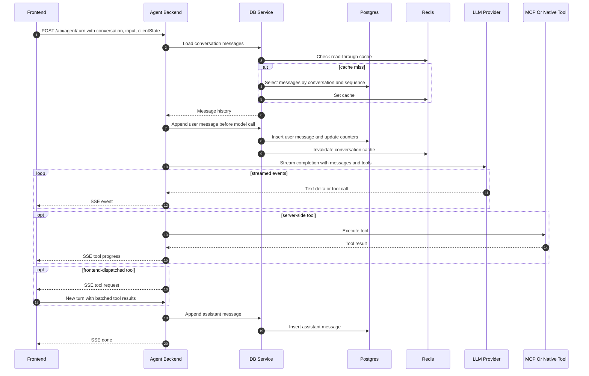
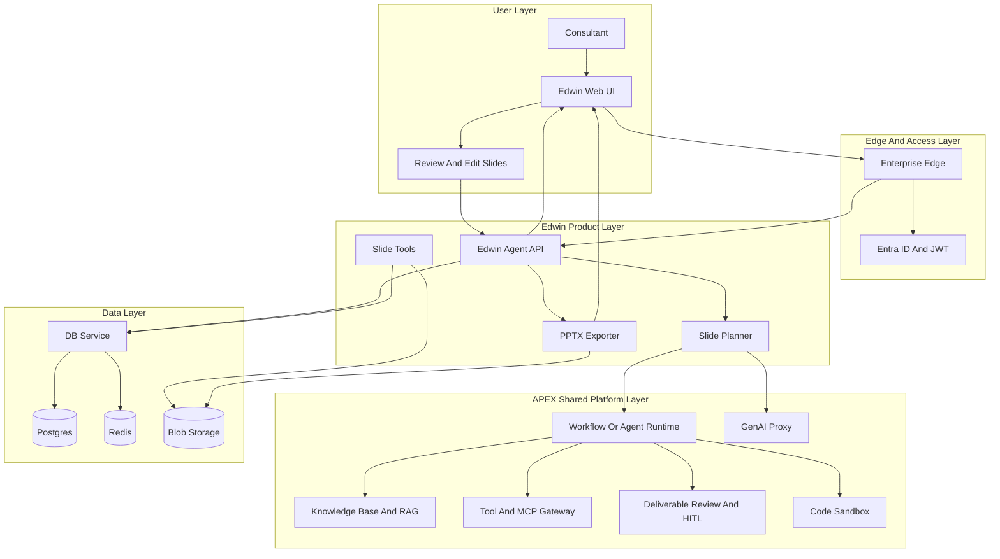

# Edwin Architecture Memo

## Purpose

This memo translates the meeting notes with Lalit into an enterprise architecture view of Edwin: what the current Edwin Slides Builder V1 does today, what the proposed Edwin V2 architecture changes, which capabilities are product capabilities versus supporting platform capabilities, and how Edwin should align with APEX OS rather than duplicate platform primitives.

The intended audience is an executive architecture review group: enterprise architects, engineering leads, product owners, and sponsors deciding how Edwin should evolve and how much of APEX OS should be shared.

## Source Base

This memo is grounded in the following inputs:

- Current Edwin V1 repository context: `PROJECT_REFERENCE.md`, `README.md`, and source architecture in `slide-generator/` and `backend/`.
- Edwin V2 architecture document: `/Users/bkaaki001/Downloads/Edwin - Architecture (1).md`.
- APEX OS platform document: `/Users/bkaaki001/Downloads/APEX_OS_PLATFORM_BIBLE (1).md`.
- APEX OS repository: `/Users/bkaaki001/Developer/vector410`.
- Market reference: Scalar public positioning at [getscalar.ai](https://getscalar.ai/) and [getscalar.ai/guide](https://getscalar.ai/guide).

## Executive Thesis

Edwin V1 is already a credible in-house AI slide-building product. It can generate and improve consulting-style slides, route user requests, ground outputs with web search, apply consulting playbooks, render HTML/CSS slides live, and export to PPTX with template-aware behavior. Its current architecture, however, is still shaped like a product application: a React-heavy experience, browser-side deck state, a thin Express proxy to PwC GenAI Shared Services, and a single Azure App Service deployment model.

Edwin V2 moves the design from "AI slide app" toward "durable agentic workbench for presentation creation." The key architectural shift is server-side durability: projects, conversations, append-only messages, and slides become first-class persisted records. The backend becomes stateless. Agent turns stream through SSE. Tool calls become resumable. External capabilities can be added via MCP or native tools. This is the right direction if Edwin is expected to become a reliable enterprise platform rather than a local/session-centric builder.

APEX OS is broader than Edwin. It is an enterprise multi-agent workflow platform with LangGraph execution, knowledge bases, RAG, structured data, sandboxed code execution, deliverable review, HITL approval, marketplace governance, Azure Container Apps deployment, Key Vault, managed identities, and Postgres/Redis/Blob infrastructure patterns. Edwin should not rebuild those primitives unless there is a strong product reason. Edwin should specialize in the consulting slide domain: storyline, pyramid-principle deck planning, master-template fidelity, PPTX export quality, slide layout intelligence, Strategy&/PwC branding, and consultant-specific UX.

The target architecture should therefore be:

> Edwin as a specialized slide-building product and agent experience, using APEX OS as the enterprise platform foundation where platform capabilities are mature enough to share.

## Meeting Notes Translated Into Architecture Questions

The meeting notes imply seven architecture questions:

1. **What does Edwin do now, and what should it do in future?**  
   V1 solves AI-assisted slide creation and editing. V2 should solve durable, governed, multi-turn consultant work where decks, messages, tools, and outputs survive across sessions and scale beyond one browser state.

2. **Which items are user-facing capabilities versus supporting technical components?**  
   "Generate a slide" is a product capability. "LLM proxy", "MCP server", "db-service", "Redis cache", and "SSE stream" are supporting components. The memo separates these so the roadmap does not confuse features with infrastructure.

3. **What is the agentic loop?**  
   In V1, agentic behavior exists mostly inside the frontend and service modules. In V2, the loop is a backend-owned turn protocol: persist user input, load context, call LLM with tools, stream progress, execute tools, persist assistant output, mutate slide rows, and resume cleanly when user input or approvals are required.

4. **What is the role of the LLM wrapper and model gateway?**  
   V1 calls PwC GenAI through `/api/ai/*` proxy routes. V2 and APEX should converge on a controlled model access layer with policy, usage, retries, streaming, and cost attribution.

5. **Do we need an agentic server, FastAPI microservices, or both?**  
   V2 proposes a FastAPI agent backend and a separate FastAPI `db-service`. APEX already has a FastAPI orchestration layer and LangGraph runtime. The decision is whether Edwin owns a specialized agent server that reuses APEX services, or whether Edwin becomes an APEX workflow/application module.

6. **How does data flow from conversation start to final output?**  
   V2 makes this explicit: browser to agent API, agent API to data service, Postgres/Redis for state, LLM/tool execution, SSE events back to UI, slide rows updated, PPTX export produced.

7. **How does this merge into APEX OS?**  
   The practical answer is not "copy Edwin into APEX" or "copy APEX into Edwin." It is capability alignment: reuse APEX for enterprise platform concerns and keep Edwin-specific slide intelligence as a bounded product domain.

## Capability Map: Current, Future, and Platform Support

| Capability area | Current Edwin V1 | Planned Edwin V2 | APEX OS leverage |
|---|---|---|---|
| User conversation | Docked AI panel in React, unified triage, router, SmartActionCard review, quick actions | Durable conversations under projects, append-only messages, resumable turns | APEX chat/session runtime patterns, SSE execution streams, checkpoint/revert concepts |
| Slide generation | AI outputs HTML/CSS slides; freestyle prompt system; templates; theme tokens; validation | Agent tools create, update, delete, reorder persisted slide rows | APEX PowerPoint generation, template engine, deliverable lifecycle where appropriate |
| Agentic loop | Frontend-driven orchestration with `AIChatbot.jsx`, router, direct and planner paths, optional consulting team agent | Stateless backend agent loop over `/api/agent/turn`, SSE, tool execution, frontend-dispatched tool continuation | APEX LangGraph engine, tool registry, HITL, workflow execution and resume patterns |
| Research and grounding | PwC Responses API web search, router-level facts/sources, per-step search | MCP/native tools can provide web search, wiki, KB, and research tools | APEX KB/RAG, deep research, citation injection, web tools |
| Knowledge base | Browser-side/context-managed knowledge base with lightweight RAG patterns | Server-owned project/session knowledge sources should become durable | APEX KB upload, chunking, embeddings, hybrid retrieval, citations, structured-data RAG |
| Data and persistence | React Context plus `localStorage`; IndexedDB/server PPTX master storage; backend DB scaffold/fallback | Postgres users/projects/conversations/messages/slides/usage records; Redis read-through cache | APEX Postgres, Redis, Blob, RLS, repository/service patterns |
| Identity and access | MSAL login in frontend, optional allowlist, Basic Auth for deployment gate | Azure AD validated on protected calls, users keyed by `azure_oid` | APEX Entra OAuth, JWT, refresh-cookie rotation, RLS user context, Key Vault |
| PPTX output | PptxGenJS plus LLM-generated code; template-aware merge, logo injection, master shape isolation | Server-side or hybrid export path should become more deterministic and durable | APEX `python-pptx`, template placeholder engine, deliverable export, Blob storage |
| Governance and observability | Limited app-level logging/debug panels; model settings; Basic Auth/allowlist | Usage/cost record model exists in V2 design but must be wired | APEX audit, metrics, health, Key Vault, managed identities; needs OTel/IaC maturity work |
| Extensibility | Consulting skills injected into router prompts; local tool registry patterns | MCP/native tool catalog rebuilt per turn | APEX tool registry today, but APEX is not yet MCP-compliant; MCP strategy should be shared |

## Current Edwin V1: What It Does Today

### Product Capabilities

Edwin V1 is a web-based AI slide builder for Strategy&/PwC-style consulting decks. It supports:

- Chat-to-slide and chat-to-deck generation.
- Single-slide improvements and quick actions.
- Multi-slide planning through a router and SmartActionCard review.
- Freestyle slide generation where the LLM emits scoped HTML/CSS.
- Template-based generation and template switching.
- Theme tokens and branding extraction from uploaded PPTX masters.
- PPTX export through PptxGenJS and template-aware merge logic.
- Web research through the PwC Responses API.
- Consulting skills as server-side markdown playbooks injected into planning calls.
- MSAL-based login and optional staff allowlist enforcement.

This is already differentiated versus generic slide generators because it combines consulting narrative, Strategy& design conventions, web-grounded facts, and PPTX output fidelity.

### Logical Components

### Technical Components

The current system uses:

- **Frontend:** React 19 and Vite 7 under `slide-generator/`.
- **State:** `SlideContext.jsx` with reducer-managed deck state and `localStorage` persistence.
- **AI orchestration:** `AIChatbot.jsx`, `services/ai/router.js`, `services/ai/slideGeneration.js`, `services/ai/freestylePromptBuilder.js`, and related modules.
- **Rendering:** `SlidePreview.jsx` injects scoped HTML/CSS into a fixed 960x540 slide canvas.
- **PPTX:** `pptxService.js`, `pptxTemplateService.js`, `brandingExtractor.js`, PptxGenJS, and LLM-assisted HTML-to-PptxGenJS translation.
- **Backend:** Express/TypeScript in `backend/`, including `/api/ai/chat`, `/api/ai/responses`, `/api/ai/models`, `/api/skills`, auth/allowlist, templates, themes, and organizations modules.
- **AI provider:** PwC GenAI Shared Services, with model roles for main generation, fast generation, classifier, router, search, PPTX, report, and image generation.
- **Deployment:** single Azure App Service serving the backend and built frontend.

### V1 Data Flow

### Current Strengths

Edwin V1 is strong where the product domain is specific:

- It understands consulting slide structure, not just generic presentations.
- It has an opinionated slide shell, theme tokens, templates, and master-aware export.
- It can separate planning from rendering, which is important for controllability.
- It supports fast and premium model roles rather than one generic model path.
- It has a viable UX for iterative slide refinement, not just one-shot generation.

### Current Constraints

The current architecture also has clear constraints:

- **Browser-heavy state:** deck state is primarily client-managed, so enterprise durability depends on browser/session behavior unless exported or saved through specific flows.
- **Thin backend:** the backend secures API keys and provides proxy routes, but it is not yet the main owner of conversations, slides, or agent execution.
- **Limited durable agent loop:** V1 has agent-like behavior, but not a backend-owned turn protocol with durable message/tool state.
- **Scaling model:** single App Service deployment is simple, but not the same as horizontally scalable agent orchestration.
- **RAG and knowledge base maturity:** useful patterns exist, but APEX has a more mature knowledge platform with chunking, vector search, citations, and structured data.

## Planned Edwin V2: Target Architecture

The Edwin V2 architecture document describes a more enterprise-ready pattern:

- React/Vite frontend with MSAL.
- Stateless FastAPI backend on port 8000.
- Separate FastAPI `db-service` on port 8001.
- Postgres 16 as authoritative system of record.
- Redis 7 as read-through cache.
- SSE endpoint `/api/agent/turn` for streamed agent turns.
- Internal LLM provider adapter for streaming completions and retries.
- MCP servers listed in `mcp_servers.yaml`.
- Langfuse observability target.
- Durable projects, conversations, append-only messages, slides, and usage records.

### V2 Logical Architecture

### V2 Agentic Loop

The important design shift is the backend-owned turn. The backend is no longer just a proxy; it becomes the orchestrator of durable work.

### Key V2 Invariants

V2 introduces several enterprise-grade invariants:

- **User input is durable before LLM execution.** A backend crash can lose a partial assistant response, but not the user request.
- **Backend is stateless.** Conversations, messages, projects, and slides live in Postgres, enabling horizontal scale.
- **Messages are append-only.** This supports pagination, auditability, concurrency, and safer retries.
- **Redis is never authoritative.** It improves read latency but does not own truth.
- **Tool execution is resumable.** Frontend-dispatched tools can bridge turns without requiring server memory.
- **Slides are project-scoped rows.** Agent tools create, update, delete, reorder, or replace slides and notify the frontend via SSE.

### V2 Data Model

The V2 document defines a deliberately simple relational model:

- `users`: keyed by Azure AD `oid`.
- `projects`: user-owned containers for work.
- `conversations`: chat threads inside projects.
- `messages`: append-only rows with role, sequence, and JSONB content blocks.
- `slides`: ordered project-scoped slide HTML rows.
- `usage_records`: append-only model/token/cost records.

The main open issue in the V2 document is that `usage_records` are modeled but not yet wired into the agent loop. For enterprise adoption, this should be treated as a launch requirement if cost transparency, chargeback, or usage governance matter.

## APEX OS: What It Provides

APEX OS is not a slide builder. It is a broader enterprise AI workflow platform. Its current repository and platform bible describe:

- Visual workflow designer.
- Workflow lifecycle management.
- Per-session chat runtime.
- Conversational multi-agent execution.
- Knowledge base management with hybrid retrieval.
- Structured-data RAG for Excel and CSV.
- Citation tracking.
- Deliverable factory with review lifecycle.
- PowerPoint generation through LLM-driven and template-driven paths.
- DOCX/PDF export.
- Visualization DSL renderer.
- Interactive code executor with AI co-pilot.
- Sandbox-side SDK.
- HITL approval.
- Deep research.
- Web search and navigation tools.
- Marketplace and approval workflow.
- File uploads.
- Conversation checkpoints.
- SSE streaming.
- Dynamic model discovery.
- Microsoft SSO.
- Feedback capture.

Technically, APEX is built on FastAPI, LangGraph, async SQLAlchemy, Postgres with pgvector and lexical search, Redis, Blob storage, Azure Container Apps, Azure Container Instances for sandboxing, Key Vault, managed identities, and GitHub Actions/JFrog deployment pipelines.

## Edwin and APEX: Capability Boundary

The boundary should be explicit:

### Edwin Should Own

- Consulting presentation product UX.
- Slide and deck-specific interaction patterns.
- Storyline creation and pyramid-principle narrative rules.
- Consulting title/subtitle conventions.
- Slide layout, visual hierarchy, and 960x540 canvas logic if retained.
- Strategy&/PwC brand behavior and master template interpretation.
- Template selection, slide transformation, and reimagine behavior.
- HTML/CSS slide representation and any future canonical slide model.
- PPTX fidelity requirements that are specific to consulting decks.
- Domain-specific prompts, playbooks, and evaluation criteria.

### APEX Should Own Or Provide

- Enterprise identity and token management.
- User, session, project, file, and durable storage patterns where reusable.
- RAG ingestion, embeddings, hybrid retrieval, citations, and structured-data query.
- Workflow execution primitives.
- Tool registry and eventual MCP client/server gateway.
- HITL and deliverable review lifecycle.
- Secure code execution and sandbox SDK.
- Azure landing-zone deployment patterns.
- Secrets, managed identities, health, metrics, audit, and observability.
- Shared model gateway strategy and usage/cost attribution.

### Shared Or Converged Areas

Some areas need explicit architecture decisions because both Edwin and APEX have relevant capabilities:

- **PowerPoint generation:** Edwin currently has a strong HTML/CSS-to-PPTX and template merge pipeline. APEX has `python-pptx` and a placeholder-template engine. These should be compared through fidelity tests before choosing one or merging them.
- **Agent runtime:** Edwin V2 proposes its own FastAPI agent backend. APEX has LangGraph workflow execution. The decision is whether Edwin needs a specialized turn loop or should run as an APEX workflow/application.
- **MCP:** Edwin V2 expects MCP servers. APEX currently has internal LangChain-style tools and is not yet MCP-compliant. A shared MCP gateway strategy would benefit both.
- **Knowledge base:** Edwin can consume APEX KB/RAG rather than maintain a lighter parallel RAG stack.
- **Observability:** APEX has health and metrics but still needs distributed tracing. Edwin should not build a separate tracing model if APEX will provide it.

## End-to-End Future Data Flow

This is the target flow from login to deck output if Edwin V2 is aligned with APEX shared services.

### Layer Comments

**User layer:** consultants interact through a slide-native experience: prompt, review plan, refine slides, approve content, and export. The product must feel like a consulting slide builder, not a generic workflow engine.

**Edge and access layer:** enterprise access should be handled once using Entra ID, JWT/session patterns, WAF/edge controls, and centrally managed network/security policy.

**Edwin product layer:** Edwin owns slide semantics: storyline, slide planning, templates, slide operations, prompt policy, and export behavior. This is where product differentiation lives.

**APEX shared platform layer:** APEX should provide reusable work execution services: model gateway, workflow runtime, tools, RAG, citations, HITL, sandbox, and eventually MCP gateway.

**Data layer:** durable state belongs server-side. Projects, conversations, messages, slides, usage records, files, exports, and checkpoints should not depend on browser storage as the source of truth.

## What Edwin Solves Now Versus Future

### Now: Edwin V1

Edwin V1 solves the immediate productivity problem of generating and editing consulting-style slides faster. It helps consultants move from blank page to draft slides, experiment with structure, apply themes, use templates, and export to PowerPoint. It is valuable as an assisted authoring tool.

The center of gravity is the browser experience. The backend is primarily a secure AI proxy and supporting service layer. This is appropriate for a fast-moving V1 product, but it becomes limiting when the product must support durable multi-turn work, enterprise auditability, shared projects, agent tools, cost tracking, and reliable recovery.

### Future: Edwin V2

Edwin V2 should solve a broader work-management problem: a consultant starts a goal, the agent plans, researches, asks questions, uses tools, creates and edits slides, persists the deck, and can resume work across sessions. The product outcome remains a deck, but the technical outcome is a durable agentic work record.

Future Edwin should support:

- Project and conversation continuity.
- Durable slide state independent of browser storage.
- Streamed progress and tool execution.
- Research and citations that can be reviewed.
- Knowledge base and structured-data use.
- Cost and usage traceability.
- Human approval points.
- Enterprise deployment, observability, and security controls.
- Better PPTX determinism and master-template compliance.

## Market Assessment: Consultant Slide Tools

Scalar is the most relevant public reference because it positions itself directly for consultants and strategists. Its public material emphasizes:

- Native PowerPoint execution.
- Slide Mode, Deck Mode, Data Mode, and AI Assistant.
- Strategy workflows rather than generic presentation generation.
- Firm template conformity.
- Analysts shifting from builders to reviewers.
- Senior consultants focusing on insight and narrative.
- Revenue capacity without proportional headcount growth.
- Prompting patterns for action titles, visual frameworks, data fidelity, layout control, and audience calibration.

The market signal is clear: consultant slide tools are not judged only by "can it make a nice slide." They are judged by:

- Does it work where consultants already work, especially PowerPoint?
- Does it respect firm templates and engagement standards?
- Can it generate consulting visuals such as waterfalls, bridges, matrices, roadmaps, and benchmarks?
- Can users control the story, data, audience, and layout?
- Can outputs survive partner review?
- Is it secure and enterprise-governed?

### Implications For Edwin

Edwin should explicitly package its capabilities into user-understandable modes:

- **Slide mode:** improve or create one slide.
- **Deck mode:** plan and generate a coherent deck.
- **Data mode:** build data-grounded exhibits with defensible numbers and charts.
- **Research mode:** gather facts and citations before slide creation.
- **Template mode:** create within a master or known layout family.

Even if the underlying engine is unified, the product narrative should match how consultants think. APEX can support the runtime and data capabilities, but Edwin must own the consulting authoring experience.

## Recommended Roadmap

### Phase 1: Stabilize Edwin V2 Foundations

- Implement durable project, conversation, message, and slide persistence.
- Move core agent turn handling to a stateless backend.
- Stream execution with SSE and persist user messages before model calls.
- Implement slide mutation tools for create, update, delete, reorder, and replace.
- Wire usage and cost recording into the agent loop.
- Keep the V1 slide generation/prompting logic available while migrating state ownership server-side.

### Phase 2: Align With APEX Shared Services

- Reuse APEX identity, deployment, Key Vault, managed identity, and storage patterns where viable.
- Decide whether Edwin uses APEX workflow runtime directly or consumes selected services behind APIs.
- Integrate APEX KB/RAG and citation services for research-grounded decks.
- Evaluate APEX PPTX template engine against Edwin's PPTX export pipeline using real Strategy& decks.
- Define a shared model gateway, usage attribution, and observability pattern.

### Phase 3: Differentiate Edwin As A Consulting Slide Product

- Formalize product modes: Slide, Deck, Data, Research, Template.
- Improve deterministic chart/data handling.
- Add stronger source/citation UX.
- Build a consulting visual grammar library and test suite.
- Add workflow templates for common consulting deliverables.
- Evaluate PowerPoint add-in or deeper PowerPoint-native integration if user adoption demands it.

## Key Architecture Decisions

### Decision 1: Edwin-Owned Agent Server Or APEX Runtime

**Question:** Should Edwin V2 run its own FastAPI agent server, or should it become an APEX workflow/application?

**Recommendation:** Start with an Edwin-owned agent API if it accelerates V2, but design its boundaries to consume APEX services. Do not hard-code platform concerns that APEX should own. Revisit once APEX runtime interfaces are stable enough for product specialization.

### Decision 2: Canonical Slide Representation

**Question:** Is the canonical slide representation HTML/CSS, structured JSON, PPTX template placeholders, or a hybrid?

**Recommendation:** Keep HTML/CSS as the near-term creative representation because V1 already has strong rendering and prompt patterns. Introduce a structured intermediate model for charts, tables, sources, and layout semantics where determinism matters. Use PPTX only as an export/runtime target, not the only authoring representation, until fidelity tests prove otherwise.

### Decision 3: PPTX Engine Convergence

**Question:** Should Edwin use its current PptxGenJS/LLM export, APEX `python-pptx`, or APEX placeholder templates?

**Recommendation:** Run a fidelity bake-off across representative Strategy& templates. Compare layout fidelity, chart fidelity, master compliance, speed, maintainability, and failure recovery. The likely target is hybrid: Edwin owns slide semantics and master interpretation; APEX may provide storage, template management, and deterministic placeholder filling.

### Decision 4: MCP Strategy

**Question:** Should Edwin invest in MCP independently?

**Recommendation:** Treat MCP as a shared AI platform concern. Edwin V2 needs MCP-compatible tool access, but APEX should define the gateway, security, approval, audit, and RBAC model. Edwin should define the slide-specific tools exposed through that gateway.

### Decision 5: Knowledge And Research

**Question:** Should Edwin keep its own KB/RAG stack?

**Recommendation:** Do not maintain two enterprise RAG platforms. Use APEX KB/RAG and citation services where possible. Edwin should add slide-specific retrieval prompts, relevance filters, and source-to-slide UX.

### Decision 6: Deployment Target

**Question:** Should Edwin remain a single App Service?

**Recommendation:** V1 can remain on App Service while V2 is built. V2 should target the same enterprise deployment principles as APEX: containerized services, private networking, Key Vault, managed identities, health/metrics, and CI/CD with environment promotion.

## Risks And Gaps

### Edwin V1 Risks

- Browser state is not enough for enterprise-grade durability.
- AI-generated PPTX translation can be non-deterministic.
- RAG and citations are less mature than APEX.
- Backend is not yet a full orchestration layer.
- Cost/usage attribution is limited unless wired through the backend and model gateway.

### Edwin V2 Risks

- Rebuilding platform services already present in APEX could slow delivery.
- Server-side durability introduces migration complexity from V1 state.
- The proposed usage model must be wired, not just modeled.
- MCP tool execution requires governance, not just technical connectivity.
- PPTX fidelity remains a hard product problem even if the backend architecture improves.

### APEX OS Risks Relevant To Edwin

- APEX has documented gaps: incomplete RLS coverage, no distributed tracing/APM, no IaC in repo, SSE process-local stream map, and not-yet MCP-compliant tooling.
- APEX's PowerPoint engine may not yet match Edwin's slide-specific needs.
- APEX is a broad workflow platform; embedding Edwin too deeply could dilute the product UX if not carefully bounded.

## Recommended Target Operating Model

The cleanest operating model is a layered ownership model:

- **Lalit / enterprise architecture:** define platform boundaries, APEX reuse principles, security baseline, deployment standards, and architectural decision records.
- **Youssef / Edwin V2 engineering:** own the agentic turn loop, slide tools, V2 persistence model, and migration from V1 behavior.
- **APEX platform team:** expose reusable services for identity, RAG, workflow runtime, sandbox, observability, storage, model gateway, and MCP governance.
- **Edwin product team:** own consultant workflows, slide UX, template fidelity, storyline quality, and adoption metrics.

The key governance principle should be:

> Share platform capabilities; specialize product capabilities.

## Suggested Slide Storyline

1. **Why Edwin matters:** consulting teams need to move from slide production to insight review.
2. **Where Edwin V1 is today:** a strong AI slide builder with real consulting-specific capability.
3. **Where V1 reaches its limits:** browser-heavy state, thin backend, limited durable agent execution.
4. **What Edwin V2 changes:** durable projects, conversations, messages, slides, SSE agent loop, tool execution.
5. **What APEX OS already provides:** enterprise workflow, RAG, sandbox, deliverables, identity, deployment, governance.
6. **The target architecture:** Edwin product layer on top of APEX shared platform services.
7. **Capability map:** current, planned, and platform-supported capabilities.
8. **Data flow:** user prompt to durable message, agent execution, slide mutation, export.
9. **Market reference:** Scalar and consultant slide-tool expectations.
10. **Decisions required:** runtime ownership, PPTX engine, MCP strategy, RAG reuse, deployment target.
11. **Recommended roadmap:** stabilize V2, integrate APEX, differentiate Edwin.
12. **Executive ask:** align on capability boundaries and approve a V2/APEX integration path.

## Bottom Line

Edwin should not become a generic APEX workflow screen. It should become the consulting slide specialist within the broader enterprise AI platform. APEX should provide the reusable operating system; Edwin should provide the high-value product experience that turns consultant intent, evidence, and firm standards into client-ready decks.
